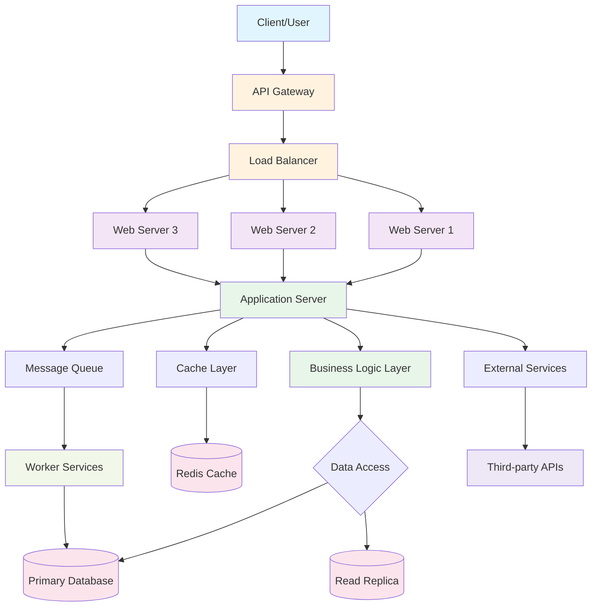

# Architecture Overview

This document provides a visual representation of the system architecture.

## System Architecture

## Components

- **API Gateway**: Entry point for all client requests
- **Load Balancer**: Distributes traffic across multiple web servers
- **Web Servers**: Handle incoming HTTP requests
- **Application Server**: Core business logic execution
- **Database**: Primary data storage with read replicas
- **Cache Layer**: In-memory data caching for performance
- **Message Queue**: Asynchronous task processing
- **Worker Services**: Background job processing
- **External Services**: Integration with third-party APIs